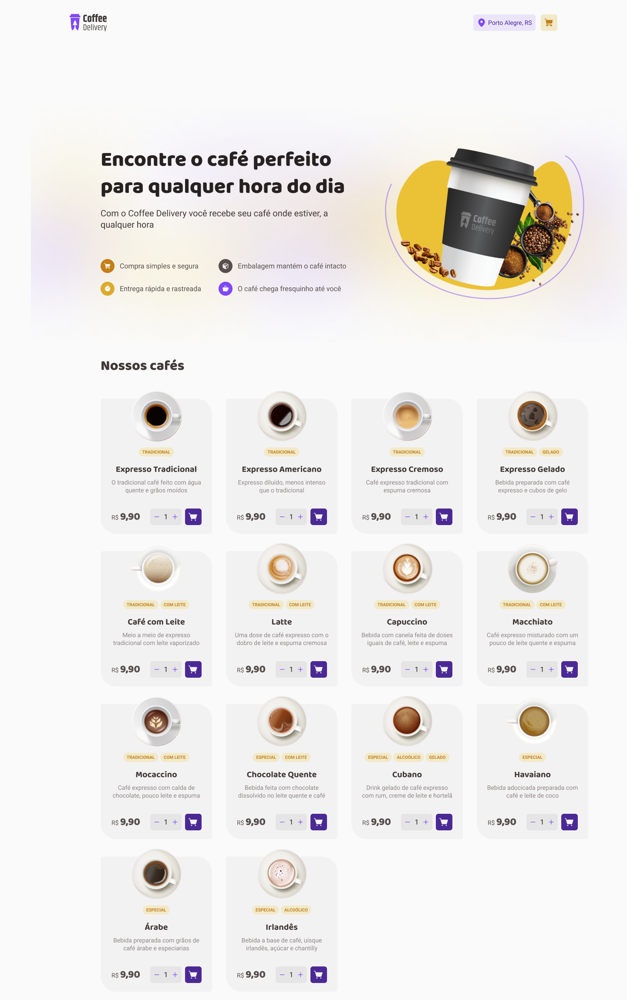
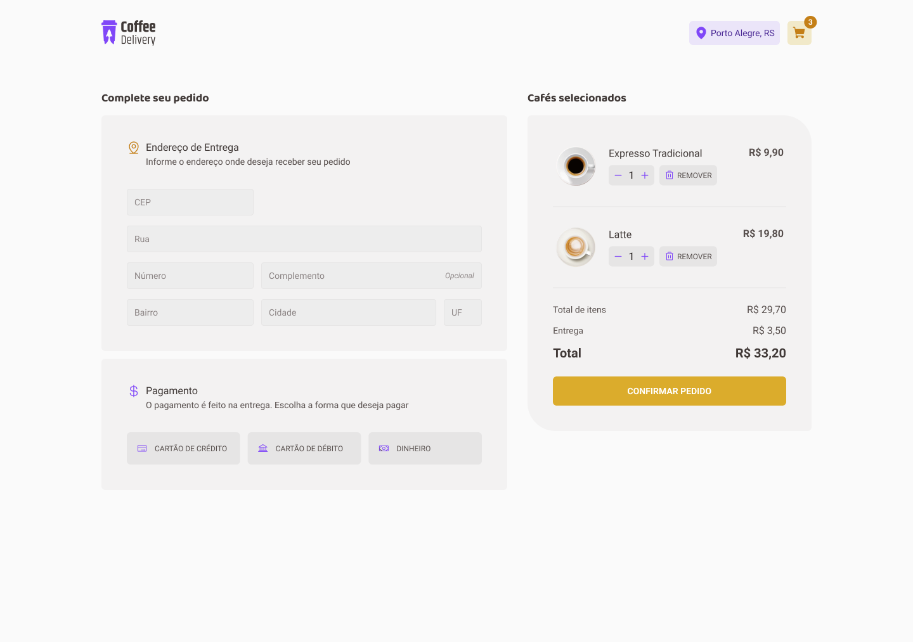
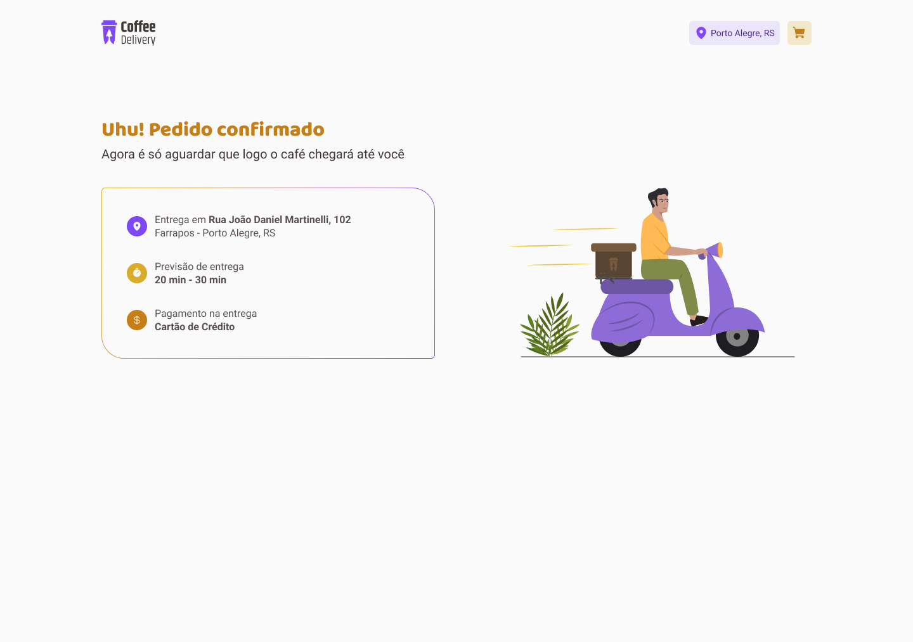

# Coffee Delivery

> Trilha Ignite

Segunda desafio desenvolvido na trilha Ignite da Rocketseat com ReactJS, Styled-Components e TypeScript. A ideia foi criar uma aplicação de Delivery de cafés.

Além de todos os fundamentos do React, foi utilizado ContextAPI para compartilhar os dados entre as rotas, um pouco de hooks, e para a estilização foi aplicado o Styled-Components.

Second challenge developed on Rocketseat's Ignite track with ReactJS, Styled-Components and TypeScript. The idea was to create a coffee delivery application.

In addition to all the React fundamentals, the ContextAPI was used to share the data between the routes, some hooks, and for the styling it was applied in Styled-Components.

## 🛠 Technologies

- React
- React-Router-Dom
- TypeScript
- Styled-Components

## 🧑‍💻 Applications

- React Hooks
- React Router
- Context API
- immutability
- Components
- Typing with typescript
- Styled-Components

## 💛 Contact

- Email --> samueldenisbb@gmail.com

OBS: PARA QUE AS IMAGENS CARREGUEM NO ARQUIVO src/CoffeeListArray.ts COLOQUE SEU LOCALHOST